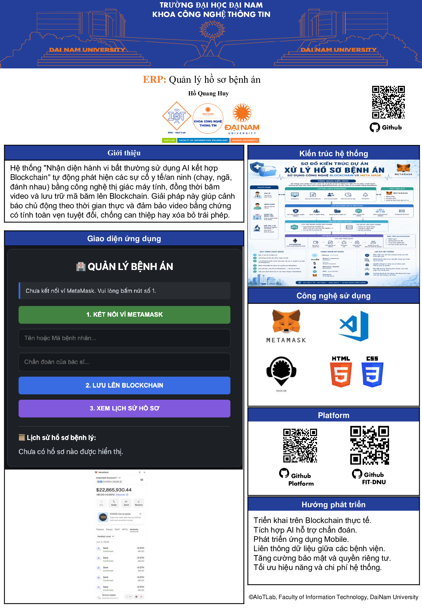

<h2 align="center">
    <a href="https://dainam.edu.vn/vi/khoa-cong-nghe-thong-tin">
    🎓 Faculty of Information Technology (DaiNam University)
    </a>
</h2>
<h2 align="center">
 🎥 HỆ THỐNG NHẬN DIỆN HÀNH VI BẤT THƯỜNG TRONG CAMERA GIÁM SÁT
<br>SỬ DỤNG AI KẾT HỢP CÔNG NGHỆ WEB3 BLOCKCHAIN
</h2>
<div align="center">
    <p align="center">
      
      
    </p>

[](https://dainam.edu.vn/vi/khoa-cong-nghe-thong-tin)
[](https://dainam.edu.vn)

</div>

---

<p align="center">
  
</p>

---

## 📖 1. Giới thiệu tổng quan hệ thống đề tài

Hệ thống **"Nhận diện hành vi bất thường sử dụng AI kết hợp Blockchain"** là giải pháp giám sát an ninh thông minh, tự động hóa quy trình phân tích dữ liệu video và bảo vệ chứng cứ kỹ thuật số tối cao thông qua kiến trúc lai đột phá:

- **AI Engine (Phân hệ Trí tuệ nhân tạo):** Ứng dụng các thuật toán thị giác máy tính để tự động nhận diện đối tượng, trích xuất khung xương người (Pose Estimation) theo thời gian thực và phân tích chuỗi hành động nhằm phát hiện, cảnh báo lập tức các hành vi bất thường nguy hiểm như chạy hỗn loạn, té ngã đột ngột hoặc hành vi nghi ngờ đánh nhau từ video người dùng tải lên.
- **Blockchain Ledger (Phân hệ Chuỗi khối):** Đóng vai trò bảo mật dữ liệu tối cao bằng cách băm video sự cố bằng thuật toán mật mã học và lưu trữ mã băm (Video Hash) cùng mốc thời gian (Timestamp) trực tiếp lên Smart Contract. Do tính chất bất biến của Blockchain, bằng chứng video được đảm bảo toàn vẹn tuyệt đối, chống can thiệp hay xóa bỏ trái phép từ quản trị viên hoặc tin tặc.

**Giá trị cốt lõi:** Chuyển đổi mô hình giám sát từ thụ động (xem lại sau sự cố) sang chủ động thời gian thực, đồng thời thiết lập kho lưu trữ bằng chứng khách quan, an toàn và có giá trị pháp lý cao cho hạ tầng an ninh đô thị thông minh.

---

## 🔧 2. Kiến trúc phân hệ và Công nghệ sử dụng

Hệ thống được phát triển theo mô hình ứng dụng phi tập trung (dApp) phân tầng công nghệ chặt chẽ:

[ Giao diện Người dùng (HTML5/CSS3/Vanilla JS) ]
│
┌─────────────┴─────────────┐
▼ (Tương tác Web3)           ▼ (Đồng bộ cục bộ)
[ Ví MetaMask ]             [ Mock Storage Bộ nhớ đệm ]
│                           │
▼ (RPC Cổng 8545)           ▼
[ Hardhat Local Blockchain ] ──► [ Kết xuất Lịch sử Sự cố AI ]

### 2.1. Phân hệ Sổ cái Chuỗi khối (Web3 Backend)
- **Solidity (v0.8.28):** Ngôn ngữ lập trình hướng đối tượng kiểu tĩnh dùng để biên soạn hợp đồng thông minh lưu trữ chứng cứ an ninh lõi.
- **Hardhat Framework:** Môi trường phát triển và giả lập chuỗi khối Ethereum cục bộ tốc độ cao, cung cấp mạng lưới RPC cục bộ tại cổng giao thức `8545`.
- **MetaMask Wallet:** Ví điện tử đóng vai trò là Web3 Provider và Signer tối cao, thực hiện ký số các hash giao dịch bằng thuật toán khóa công khai mật mã.

### 2.2. Phân hệ Giao diện & Trí tuệ nhân tạo (Frontend & AI Engine)
- **HTML5 & CSS3 (Bản quyền Giao diện Tối - Dark Mode UI):** Thiết kế responsive đáp ứng, trực quan hóa các trạng thái phân tích hành vi và kết nối ví bằng các mã màu tiêu chuẩn.
- **JavaScript thuần (Vanilla JS):** Xử lý luồng tải video lên, tương tác bất đồng bộ gọi mô hình phân tích AI và điều phối cuộc gọi JSON-RPC tới mạng Blockchain.
- **Ethers.js (v5.7.2):** Thư viện JavaScript cầu nối giúp khởi tạo các thực thể Web3 kết nối trực tiếp đến mã nhị phân giao diện ứng dụng ABI của Smart Contract.

---

## 📜 3. Thiết kế kỹ thuật Hợp đồng thông minh (`SecurityRecords.sol`)

Hợp đồng thông minh định nghĩa cấu trúc dữ liệu mật mã và các hàm thành viên quản lý quyền ghi dấu vết sự cố:

### 3.1. Cấu trúc dữ liệu Bản ghi Sự cố (`IncidentRecord` Struct)
```solidity
struct IncidentRecord {
    string videoId;      // Mã định danh độc bản của đoạn video hoặc camera giám sát
    string behaviorType; // Loại hành vi bất thường được AI nhận diện (Chạy, Ngã, Đánh nhau)
    bytes32 dataHash;    // Mã băm Keccak-256 dùng làm dấu chứng thực toàn vẹn video chứng cứ
    uint256 timestamp;   // Mốc thời gian Unix thực tế của khối khi ghi nhận sự cố (block.timestamp)
}
3.2. Cấu trúc ánh xạ phân quyền (Mapping)
Solidity
// Ánh xạ địa chỉ ví của hệ thống giám sát sang mảng động chứa danh sách sự cố do AI ghi nhận
mapping(address => IncidentRecord[]) private systemIncidents;
Ghi chú bảo mật: Mảng lưu trữ được cấu hình ở phạm vi private để đóng gói an toàn, mọi hành vi truy vấn kiểm tra chéo bắt buộc phải đi qua các hàm view được thiết kế sẵn.
3.3. Đặc tả các hàm thành viên lõi
addIncident(string videoId, string behaviorType): Tiếp nhận dữ liệu phân tích từ AI, tính toán hàm băm mật mã học keccak256(bytes(behaviorType)) làm dấu chứng thực toàn vẹn. Tiến hành push bản ghi mới vào ánh xạ ví hệ thống (msg.sender) và phát ra sự kiện IncidentLogged.
getIncidentCount(address node): Trả về một số nguyên uint256 biểu thị tổng số lượng sự cố nguy hiểm đã được phát hiện và đóng khối bởi một node camera cụ thể.
getIncident(address node, uint256 index): Cho phép truy xuất chi tiết từng bộ thuộc tính của sự cố tại một chỉ mục cụ thể để phục vụ công tác điều tra và trích xuất bằng chứng.
🚀 4. Hướng dẫn chi tiết Quy trình Cài đặt và Khởi chạy
💻 Bước 1: Mở Terminal và di chuyển đường dẫn tuyệt đối
Mở phần mềm Terminal có sẵn trên máy Mac của bạn và dùng lệnh cd để đi thẳng vào thư mục chứa mã nguồn đồ án:
Bash
cd ~/blockchain_duan
🔌 Bước 2: Khởi động mạng lưới Blockchain ảo nội bộ
Tại ô dòng lệnh Terminal vừa điều hướng, gõ chính xác cú pháp sau đây rồi nhấn nút Enter:
Bash
npx hardhat node
Hiện tượng chuẩn: Mạng lưới Hardhat sẽ tự động sinh ra danh sách 20 tài khoản ví mật mã ngẫu nhiên kèm số dư ảo sẵn có là 10000 ETH và lắng nghe kết nối JSON-RPC tại cổng địa chỉ http://127.0.0.1:8545. Tuyệt đối không tắt cửa sổ dòng lệnh này đi nhe.
🛰️ Bước 3: Deploy Hợp đồng thông minh lên mạng lưới
Mở thêm một tab Terminal mới tinh độc lập, thực hiện lệnh điều hướng vào thư mục và chạy script tự động để đẩy mã bytecode của contract y tế lên chuỗi khối:
Bash
cd ~/blockchain_duan
npx hardhat run scripts/deploy_manual.js --network localhost
Hiện tượng chuẩn: Hệ thống sẽ in ra màn hình một chuỗi mã băm biểu thị địa chỉ phân phối thành công, có dạng: SecurityRecords deployed to: 0x5FbDB2315678afecb367f032d93F642f64180aa3. Hãy sao chép chuỗi 0x... này.
✍️ Bước 4: Cấu hình mã nguồn Frontend trong VS Code
Khởi chạy phần mềm chỉnh sửa mã nguồn VS Code và chọn mở thư mục dự án blockchain_duan.
Truy cập vào tệp tin index.html.
Cuộn chuột tìm đến khu vực thẻ <script> (khoảng dòng 120) và tìm hằng số:
JavaScript
const contractAddress = "NHẬP_ĐỊA_CHỈ_VỪA_COPY_TẠI_ĐÂY";
Thực hiện dán đè chuỗi địa chỉ ví contract mới vừa tạo ở Bước 3 vào giữa hai dấu ngoặc kép và nhấn tổ hợp phím Cmd + S để ghi nhận lưu file an toàn.
🌐 Bước 5: Kích hoạt Giao diện làm việc (Live Server)
Tại giao diện file index.html trong VS Code, Huy nhấp chuột phải vào vùng soạn thảo code và chọn dòng Open with Live Server (hoặc click vào nút Go Live ở thanh trạng thái nằm tại góc dưới cùng bên phải màn hình).
Trình duyệt Google Chrome sẽ tự động mở ra trang web tại liên kết mặc định: http://127.0.0.1:5500/index.html.
Bật tiện ích mở rộng MetaMask trên trình duyệt, nhấn chọn kết nối mạng nội bộ là Hardhat Local / Localhost 8545.
Tiến hành thực hiện chu trình kiểm tra chức năng: Bấm Nút số 1 để kết nối ví → Tải video lên hệ thống AI phân tích hành vi → Bấm Nút số 2 và duyệt bảng đen Xác nhận giao dịch trên MetaMask để băm video lên Blockchain → Bấm Nút số 3 để hiển thị danh sách lịch sử sự cố bóng loáng dưới đáy giao diện!
📊 5. Ma trận kết quả Kiểm thử Hệ thống (System Testing)
Quá trình kiểm thử tích hợp toàn diện hệ thống được ghi nhận cụ thể qua bảng ma trận chức năng dưới đây:
STT	Kịch bản kiểm thử (Test Case)	Dữ liệu đầu vào (Inputs)	Kết quả mong đợi (Expected)	Kết quả thực tế (Actual)	Trạng thái
1	Kiểm tra hệ thống khi trình duyệt chưa thiết lập tích hợp ví Web3.	Truy cập dApp bằng trình duyệt ẩn danh không cài MetaMask.	Hệ thống nhận diện, hiển thị thông báo yêu cầu cài đặt và khóa các nút chức năng.	Hiển thị đúng chuỗi cảnh báo, vô hiệu hóa toàn bộ form tải video.	ĐẠT
2	Kiểm tra chức năng Đăng ký/Kết nối danh tính hệ thống Camera.	Người dùng nhấp nút "1. KẾT NỐI VÍ METAMASK" và duyệt quyền định danh.	Hệ thống nhận diện thành công, chuyển đổi trạng thái giao diện và lấy địa chỉ ví làm định danh nút mạng.	Địa chỉ ví hệ Hex (0x...) hiển thị chính xác, hộp đen đổi sang màu xanh báo thành công.	ĐẠT
3	Kiểm tra phế hệ AI và Ghi chứng cứ sự cố lên chuỗi khối.	Tải clip test có hành vi Té ngã / Ẩu đả. Nhấn nút số 2 sau khi AI xử lý xong.	MetaMask tự động kích hoạt pop-up, yêu cầu ký số xác thực hash video và đóng khối.	Giao dịch được khai thác đóng khối thành công, Hardhat Terminal sinh mã transaction hash.	ĐẠT
4	Kiểm tra chức năng Đồng bộ dữ liệu lịch sử an ninh.	Nhấp chọn nút số 3 "3. XEM LỊCH SỬ SỰ CỐ" ngay sau khi đóng khối thành công.	Hệ thống thực thi vòng lặp quét, đồng bộ và hiển thị thông tin bằng chứng trực quan ra màn hình.	Bảng danh sách hành vi xuất hiện mượt mà dưới đáy giao diện với đầy đủ mốc thời gian và mã băm video.	ĐẠT
👤 6. Thông tin bản quyền và liên hệ học phần
Sinh viên thực hiện: Hồ Quang Huy
Mã số sinh viên: 1671020137
Lớp chuyên ngành: 16-01 CNTT
Giảng viên hướng dẫn khoa học: TS. Trần Đăng Công
Cơ quan chủ quản: Khoa Công nghệ thông tin - Trường Đại học Đại Nam
Hộp thư điện tử chính thức: hoquanghuy1105@gmail.com
© 2026 AIoTLab, Faculty of Information Technology, DaiNam University. All rights reserved.
